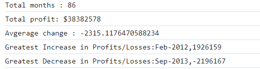

# Console Finances

## This is a JavaScript project for beginners to analyze the financial records of company.

### Description

We are given a finanical dataset of a company for a period of Jan, 2010 to Feb, 2017.
The task is to output the below information over this data using 
JavaScript concepts such as variables, loops, string concatenation, arrays and math functions in JavaScript.

1. Total numbre of months in the given dataset
2. The net total amount of profit/losses over the entire period
3. Average of the changes in profit/losses over the entire period.
4. The greatest increase in profit/losses over the entire period
5. The greatest decrease in profit/losses over the entire period

### Usage
Open the web page using the URL :

On the keyboard, press the keys fn + F12 or right click anywhere on the webpage and choose the option 'Inspect'.

The output of the calculcations carried out on the financial dataset should be visible.

### License

Licensed under MIT License.

